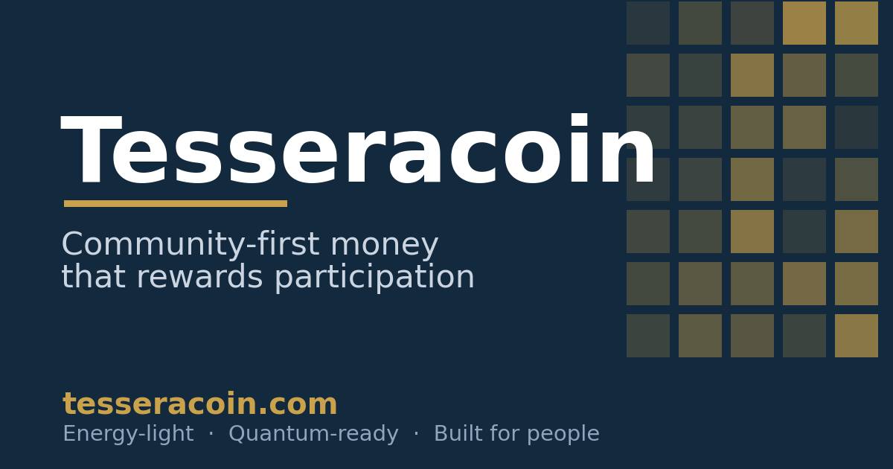
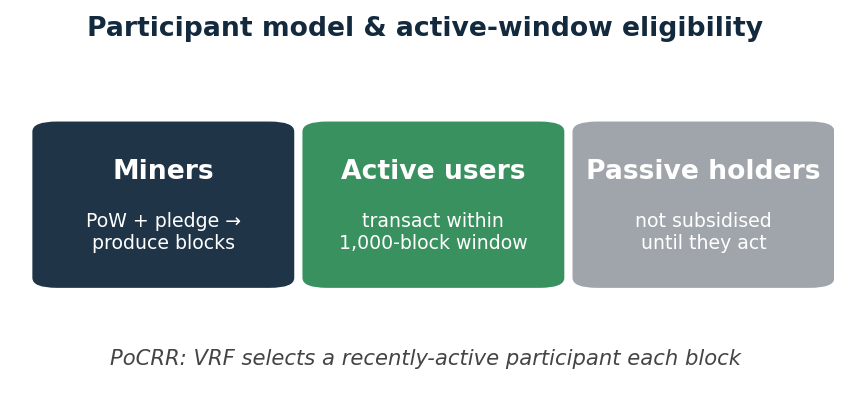
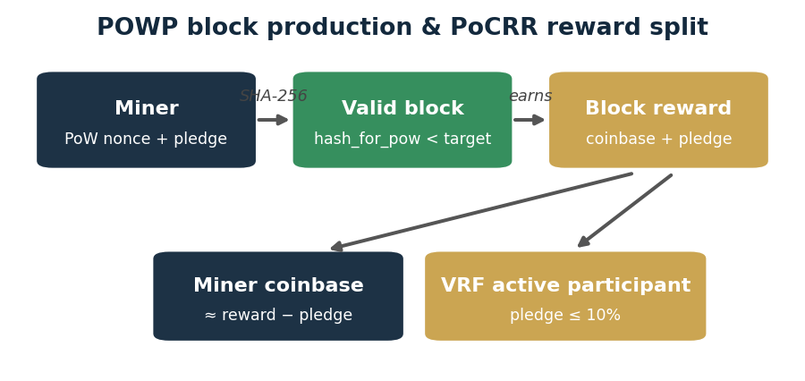
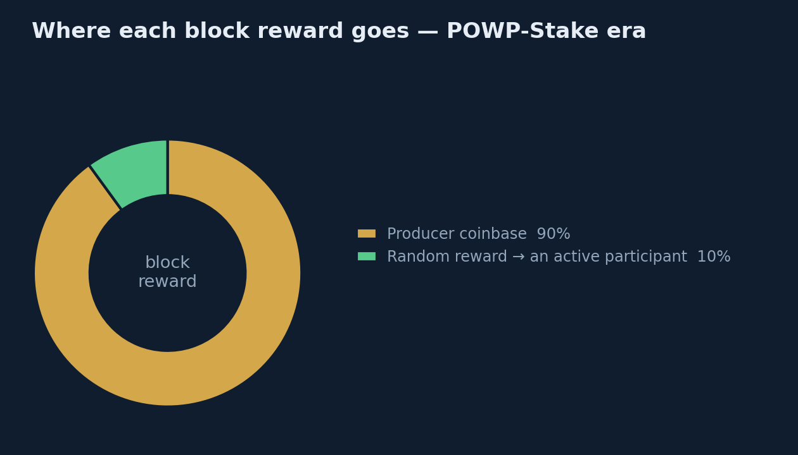
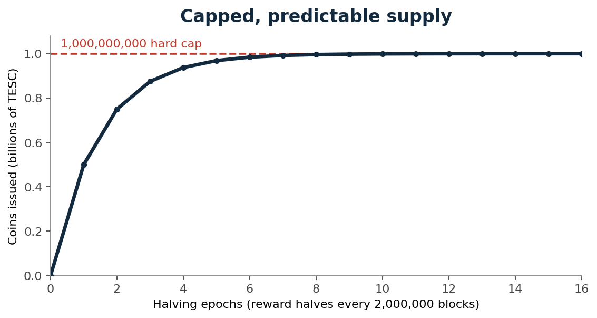
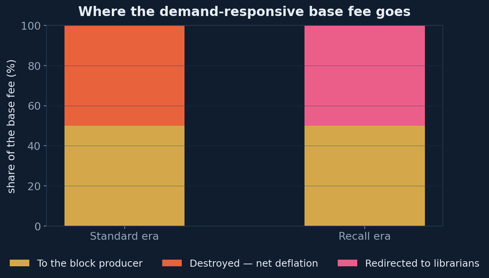
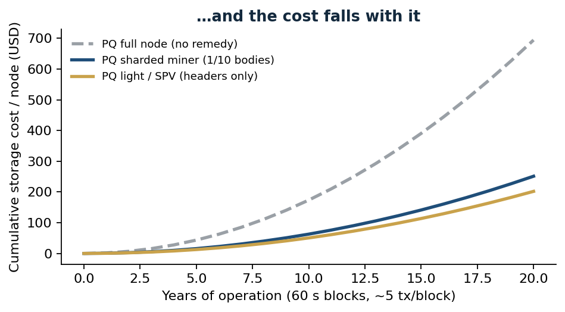
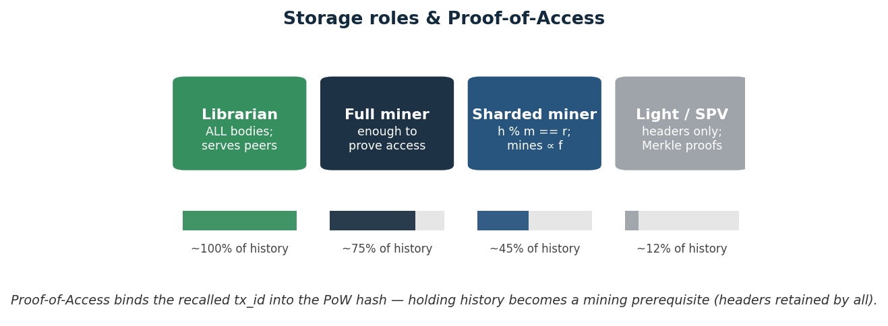
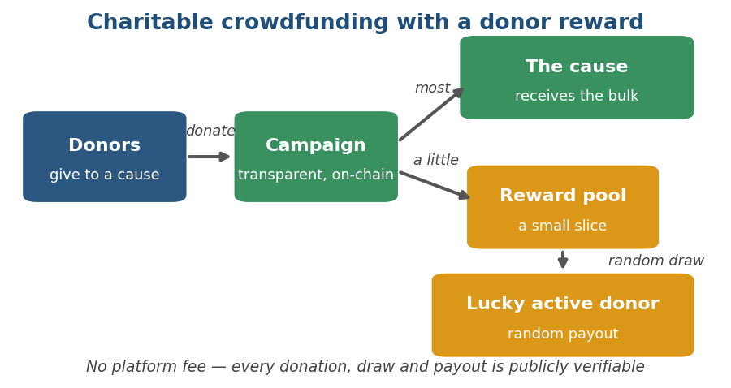

# Tesseracoin

**A community-first digital currency that *rewards participation* — and a blockchain that can change its own rules as it grows, without ever splitting the community.**

> A *tessera* was a small mosaic tile — and, in ancient Rome, a token handed
> out at public distributions to ordinary citizens. Many small pieces forming a
> greater whole; many contributors, one shared community. That is exactly what
> Tesseracoin is built to be.

### → Explore the project and try the wallet at **[tesseracoin.com](https://tesseracoin.com)**

---

## The idea in one breath

Most blockchains are born with one set of rules and are stuck with them for life — changing how they reach agreement means a contentious hard fork and, often, a split community.

Tesseracoin starts from a different question: **what if a network could grow up?**

It launches small and light, proves itself, and — on conditions written into the chain itself — **evolves its own consensus** from energy-light Proof-of-Work into locked-stake Proof-of-Stake, as a single continuous chain. No schism, no "old coin / new coin," no central switch thrown. The rules are chosen at birth and allowed to mature.

## What it is

Tesseracoin is a hybrid **Proof-of-Work + locked-Stake** blockchain with a
random-reward layer, designed for trusted communities — families, friends,
clubs, and causes. Its guiding principle is simple:

> **The network rewards the people who *use* it — not those who merely hold it.**

It is money a community runs itself: no bank, no platform fee, no single point
of control, and a public, tamper-evident record anyone can audit.

## What makes it genuinely different

- **A blockchain that evolves.** Consensus is declared at genesis and walks an
  on-chain *era ladder* — Proof-of-Work → locked Stake → Proof-of-Stake — promoting
  itself automatically when the network is ready. The same chain can be tuned to a
  ten-person club at launch and to a global community at scale, without a fork.
- **Design the whole journey, then simulate it.** A visual **network designer** lays out a
  network's eras, economics, and node roles — and spins up a full multi-node simulation of
  it — before a single real node ever goes live.
- **Rewards participation, not hoarding.** A stake-weighted slice of every block's
  reward is paid, at random, to an *active* participant — so staying engaged, not
  sitting on a balance, is what pays.
- **Energy-light by design.** Locked, slashable stake carries part of the security
  load that raw hash power otherwise would — security without a data-centre's worth
  of electricity.
- **Post-quantum from day one.** Quantum-resistant signatures are built in *now*,
  not parked on a someday roadmap — and the design absorbs their larger size instead
  of letting every node's storage balloon.
- **History stays alive — and it pays to keep it.** Archiving the chain is a rewarded
  *librarian* role: librarian nodes earn a share of fees for keeping the full history
  available and serving it on demand. And the protocol can require every miner to prove it
  still holds a specific *old* block — *block recall* — so a network's past can't quietly
  erode as nodes prune it away.
- **Runs on a phone, not a data centre.** Nodes can run a full archive, carry just a slice
  of the history, or stay featherweight-light — participation never demands heavy hardware.
- **Predictable, capped supply.** A fixed 1,000,000,000 hard cap on a transparent
  schedule, with half of all collected fees burned over time.

## A peek under the hood

For the curious — a few of the ideas that make Tesseracoin tick.

**How a block is made, and how the reward is shared.** A modest amount of work
*plus* locked, slashable on-chain stake produces a block — real economic
accountability, not raw energy. Most of the reward goes to the miner; a
stake-weighted random slice goes to an active participant.

**Consensus as a living policy.** Difficulty retargets every block, validators that
go quiet are dropped from block production by *committed, fork-proof* rules (and can
rejoin on their own), and equivocation is slashed on sight. The network is engineered
to stay live and converged even as nodes join, leave, restart, and misbehave — and it
is exercised that way continuously against simulated adversaries, partitions, and
restarts before anything ships.

**Where the value flows.** Most of a block's reward is the producer's coinbase; a
stake-weighted **random reward** is sliced off to an *active participant* every block.
The demand-responsive base fee is partly **burned** (net deflation) and partly
**redirected to the librarians** who keep the full history. And it all plays out on a
fixed, predictable schedule — the block reward halves every 2,000,000 blocks, with total
supply approaching a hard cap of 1,000,000,000 TESC.

**Built for the post-quantum era — without the storage blow-up.** Quantum-safe
signatures are large, and naively that makes every node's storage balloon. Tesseracoin
turns storing history into a shared, rewarded role, so nodes can run light or carry
just a slice — keeping participation open to ordinary hardware for the long haul.

**Right-sized node roles.** Run a full archive, a partial shard that mines in
proportion to what it stores, or a lightweight wallet — all on the same network.

## What it's for

- **A private community or family currency** — usable for real goods, dues, and
  favours within a group that trusts each other; a resilient medium of exchange the
  community runs itself.
- **Transparent community fundraising** — pool contributions for a shared cause with
  no platform fee; every contribution and disbursement is publicly verifiable on-chain.
- **Dues, splits & shared costs** — collect club dues, split expenses, or run a group
  treasury, settled member-to-member with a public record.

## Status

Tesseracoin is an advanced, **extensively tested prototype** in active private
development. Multi-node networks already run end-to-end — promoting across consensus
eras, slashing equivocators, paying random rewards, and recovering from node churn —
backed by **1,360+ unit tests, 45 multi-node chaos scenarios** (partitions, restarts,
equivocation, block forgery), and continuous live-network simulation. The source code is
private for now; this repository is a **preview** of what's coming. The next milestone is
a friendly web app so anyone can take part — send, receive, and contribute — without
touching the technology underneath.

## Roadmap (high level)

- ✓ Core protocol — hybrid consensus, self-evolving eras, random rewards
- ✓ Future-proof (post-quantum) cryptography
- ✓ Lightweight participation — light clients and shared-history storage
- ◷ Web app for community payments & fundraising
- ◷ Programmable features (smart contracts, collectibles)

## Learn more

- **The website — start here:** **[tesseracoin.com](https://tesseracoin.com)**
- **[Protocol design](docs/DESIGN.md)** — hybrid consensus, the era ladder,
  stake-weighted random rewards, fork choice, the economic model, and the cryptography
- **[Operator guide](docs/OPERATOR_GUIDE.md)** · **[Deployment](docs/DEPLOYMENT.md)** ·
  **[Consensus upgrades](docs/CONSENSUS_UPGRADES.md)** · **[Troubleshooting](docs/TROUBLESHOOTING.md)**

## Feedback wanted — on the design and docs

This repository is a **documentation preview**. The source code and a license will be
added later; until then, review and critique of the **design and the docs** is exactly
what's useful. Please:

- open an [issue](https://github.com/softmillennium/tesseracoin/issues) for an error, a
  stale detail, or a question, or
- start a [discussion](https://github.com/softmillennium/tesseracoin/discussions) on the
  design — [`docs/DESIGN.md`](docs/DESIGN.md) is meant to be argued with.

Code-level contributions will open once the source and its license are published.

---

*A note on maturity: Tesseracoin is a carefully engineered prototype, not yet a
finished public product. As with anything handling value — start small, verify
everything, and grow with confidence.*

## License

The **documentation** in this repository (everything under `docs/`, plus this
`README.md`) is licensed [**CC-BY-4.0**](docs/LICENSE) — quote, share, adapt, and review
it freely, with attribution. Design feedback and corrections are welcome.

The **source code** is not yet published. When released it will ship under the
**Apache-2.0** license; until then it is © 2026 SoftMillennium, all rights reserved.
