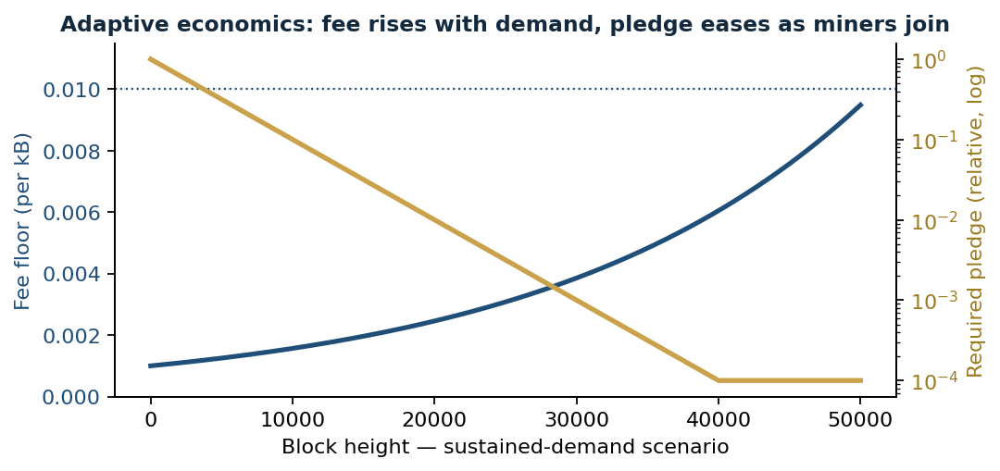
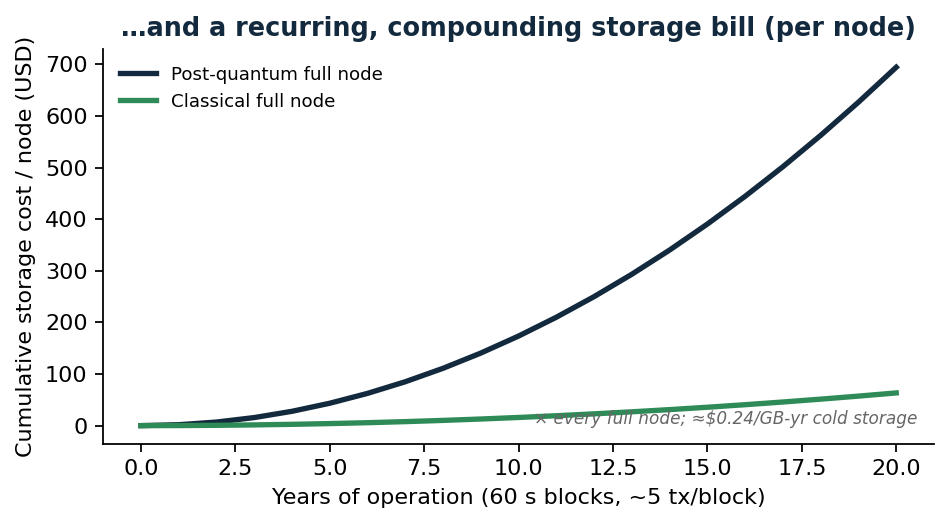

# Tesseracoin

**A community-first digital currency that rewards participation — energy-light, future-proof, and built to last.**

> A *tessera* was a small mosaic tile — and, in ancient Rome, a token handed
> out for charitable grain distributions and public lottery draws. Many small
> pieces forming a greater whole; a token for giving and for chance. That is
> exactly what Tesseracoin is built to be.

---

## What it is

Tesseracoin is a hybrid **Proof-of-Work + Pledge (POWP)** blockchain with a
random-reward layer (**PoCRR**), designed for trusted communities — families,
friends, clubs, and causes. Its guiding principle is simple:

> **The network rewards the people who *use* it — not those who merely hold it.**

It is money a community runs itself: no bank, no platform fee, no single point
of control, and a public, tamper-evident record everyone can audit.

## How it works (in brief)

- **Miners** do a modest amount of work *and* stake a refundable **pledge** —
  skin in the game — to add a block. This keeps the network honest without
  Bitcoin-scale energy use.
- **Active participants** earn a share of rewards, chosen at random — so
  staying engaged, not hoarding, is what pays.

## What makes it different

- **Rewards participation, not hoarding.** Random rewards flow to active members.
- **Energy-light by design.** A pledge layer carries part of the security load
  that raw hash power otherwise would.
- **Future-proof cryptography.** Post-quantum signatures are built in *now* —
  not on a someday roadmap.
- **Upgradable without a hard fork.** Consensus rules can change through a
  governed, on-chain process — software-style releases, not community schisms.
- **Storage that scales down to your device.** Nodes can run light or share the
  load of history, so participation never demands a data centre.
- **Sound, capped money.** A fixed supply of 21,000,000 on a predictable
  schedule — and 60-second blocks.

## What you can build on it

- **A private community / family currency** — exchangeable for real value
  within a group you trust; a resilient, self-run store of value.
- **Charitable crowdfunding with a donor reward** — fund a cause *and* become
  eligible for a random thank-you payout from the pool. No platform fee, and
  every donation and draw is publicly verifiable.
- **A community lottery / raffle** — where sustained participation, not a
  one-time ticket, keeps you eligible.

## A peek under the hood

For the curious — a few of the ideas that make Tesseracoin tick.

**How a block is made, and how the reward is shared.** Work plus a pledge
produces a block; most of the reward goes to the miner, a slice to a randomly
chosen active participant.

**Adaptive economics.** Transaction fees rise gently with demand, while the
pledge required to mine eases as more miners join — keeping participation
accessible as the network grows.

**Built for the post-quantum era — without the storage blowup.** Quantum-safe
signatures are large, and naively that makes every node's storage balloon over
time. Tesseracoin's design turns storing history into a shared, rewarded role,
so nodes can run light or carry just a slice — keeping participation open to
ordinary hardware for the long haul.

**Right-sized node roles.** Run a full archive, a partial shard that mines in
proportion to what it stores, or a lightweight wallet — all on the same network.

## Status

Tesseracoin is an advanced, extensively tested **prototype** in active private
development. A multi-node network already runs end-to-end. The source code is
private for now; this repository is a **preview** of what's coming. The next
major milestone is a friendly web app so anyone can take part — donate, win,
and transact — without touching the technology underneath.

## Roadmap (high level)

- ✓ Core protocol — hybrid consensus, random rewards, governed upgrades
- ✓ Future-proof (post-quantum) cryptography
- ✓ Lightweight participation — light clients and shared-history storage
- ◷ Web app for charitable crowdfunding & community lotteries
- ◷ Programmable features (smart contracts, collectibles)

## Documentation

The protocol design and operator guides are published in [`docs/`](docs/README.md):

- **[Protocol design](docs/DESIGN.md)** — POWP consensus, PoCRR random rewards, fork choice, economic model, and cryptography
- **[Operator guide](docs/OPERATOR_GUIDE.md)** · **[Deployment](docs/DEPLOYMENT.md)** · **[Consensus upgrades](docs/CONSENSUS_UPGRADES.md)** · **[Troubleshooting](docs/TROUBLESHOOTING.md)**
- Website: **https://tesseracoin.com**

## Feedback wanted — on the docs

This repository is a **documentation preview**. The source code and a license
will be added at a later stage; until then, review and critique of the **design
and the docs** is exactly what's useful. Please:

- open an [issue](https://github.com/softmillennium/tesseracoin/issues) for an
  error, a stale detail, or a question, or
- start a [discussion](https://github.com/softmillennium/tesseracoin/discussions)
  on the design — [`docs/DESIGN.md`](docs/DESIGN.md) is meant to be argued with.

Code-level contributions will open once the source and its license are published.

---

*A note on maturity: Tesseracoin is a carefully engineered prototype, not yet a
finished public product. As with anything handling value — start small, verify
everything, and grow with confidence.*

## License

The **documentation** in this repository (everything under `docs/`, plus this
`README.md`) is licensed [**CC-BY-4.0**](docs/LICENSE) — quote, share, adapt, and
review it freely, with attribution. Design feedback and corrections are welcome.

The **source code** is not yet published. When it is released it will ship under
the **Apache-2.0** license; until then it is © 2026 SoftMillennium, all rights
reserved.
